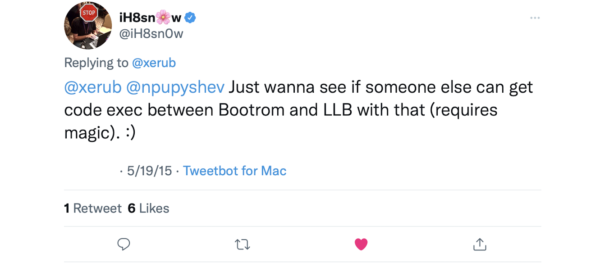

# Image3RE
Now not just Image3. But a collection of all resources I produced while reversing A6 bootrom and looking for bugs there - reversed source codes, IDA databases, various tools and etc.

***Important note:** I'm a bad reverse engineer/hacker/software developer/etc., so use the materials from this repository with a great caution!*

## Long story short
Back in May 2015 Steven De Franco (also known as @iH8sn0w) made some real interesting claims in a [conversation](https://twitter.com/ih8sn0w/status/600403430415413250?s=21) on Twitter

Here are the most interesting parts:




These tweets made me (and many other people) look into Image3 stack of bootroms, especially of A6 one, because Steven mostly demonstrated his "untethered jailbreaks with custom logo and verbose mode" on an iPhone 5 - [1](https://youtu.be/BtBqkj7RsFo), [2](https://youtu.be/z5Lto14kvuQ)

***Important note:** I don't really know for sure if Steven had a real bootrom exploit for A6 or not, but these materials above make me think that yes, he did. If you want to accuse me in creating problems for Steven by publishing these words (and all the previous), then consider the following - I have never talked with Steven about it in private and it's not my fault he published those tweets and videos - I assert I may feel free to interpret them the way I want, especially considering they are all still in the public domain. This note might look weird for a reader, but I recieved such an accusation before, and don't want it again*

## Bugs
The most interesting part, I guess. Here is the list of the bugs I managed to find:

 1. [Nested image memory leak](https://twitter.com/nyan_satan/status/1225106474566811648?s=21)
 2. [CERT memory corruption](https://twitter.com/nyan_satan/status/1225106524021972992?s=21)
 3. [H2FMI bootpage bug](https://twitter.com/nyan_satan/status/1398708563430805511?s=21)
 4. [SRAM memory preservation after a panic](https://twitter.com/nyan_satan/status/1495778569884155904?s=21)
 
 Some of them might be useful, but yet they are not enough on their own

## Databases
This repository contains my IDA database with some parts of the bootrom reversed, some function names found and etc.

The database is for IDA Pro 7.6 SP1

## Dumps
A6 SecureROM dump (**iBoot-1145.3**) is available here, and along with many others on [securerom.fun](securerom.fun)

## Reversed code
You can find many of Image3 functions reversed (`Image3-1145.3.c`), as well as heap ones - `malloc()`, `free()` and everything they depend on (`heap-1145.3.c`)

## Tools
The most cursed part of the whole repository!

### heap_parse
Dumb heap parser, only works with SecureROM's SRAM dumps, because it doesn't bother itself with supporting multiple heap chunks

Usage is quite simple:

```
noone@noones-MacBook-Air ~ % heap_parse
usage: heap_parse <file> <startaddr> <size> <blocksize>
ALL VALUES MUST BE IN HEX
```

Example for A6:

```
noone@noones-MacBook-Air ~ % heap_parse a6-hack/sram-dumps/1653122994.bin 0x10063000 0x16000 0x40
0: hdr: 0x10063000, addr: 0x10063040, size: 0x0, flags: 0x0
header:
0x10063000: 00 00 00 00 01 00 00 00 00 00 00 00 00 00 00 00  ................
0x10063010: 00 00 00 00 00 00 00 00 00 00 00 00 00 00 00 00  ................
0x10063020: 00 00 00 00 00 00 00 00 00 00 00 00 00 00 00 00  ................
0x10063030: 00 00 00 00 00 00 00 00 00 00 00 00 00 00 00 00  ................

1: hdr: 0x10063040, addr: 0x10063080, size: 0x40, flags: 0x0
header:
0x10063040: 04 00 00 00 02 00 00 00 00 00 00 00 00 00 00 00  ................
0x10063050: 00 00 00 00 00 00 00 00 00 00 00 00 00 00 00 00  ................
0x10063060: 00 00 00 00 00 00 00 00 00 00 00 00 00 00 00 00  ................
0x10063070: 00 00 00 00 00 00 00 00 00 00 00 00 00 00 00 00  ................
buffer:
0x10063080: 00 31 06 10 00 00 00 00 00 00 00 00 00 00 00 00  .1..............
0x10063090: 00 01 00 00 ff 00 00 00 00 12 06 10 00 00 00 00  ................
0x100630a0: 00 00 00 00 00 00 00 00 00 00 00 00 00 00 00 00  ................
0x100630b0: 00 00 00 00 00 00 00 00 00 00 00 00 00 00 00 00  ................

2: hdr: 0x100630c0, addr: 0x10063100, size: 0x100, flags: 0x0
header:
0x100630c0: 08 00 00 00 05 00 00 00 00 00 00 00 00 00 00 00  ................
0x100630d0: 00 00 00 00 00 00 00 00 00 00 00 00 00 00 00 00  ................
0x100630e0: 00 00 00 00 00 00 00 00 00 00 00 00 00 00 00 00  ................
0x100630f0: 00 00 00 00 00 00 00 00 00 00 00 00 00 00 00 00  ................
buffer:
0x10063100: 00 00 00 00 90 0f 06 10 00 00 00 00 00 00 00 00  ................
0x10063110: 00 00 00 00 00 00 00 00 00 00 00 00 00 00 00 00  ................
0x10063120: 00 00 00 00 00 00 00 00 00 00 00 00 00 00 00 00  ................
0x10063130: 00 00 00 00 00 00 00 00 00 00 00 00 00 00 00 00  ................
0x10063140: 00 00 00 00 00 00 00 00 00 00 00 00 00 00 00 00  ................
0x10063150: 00 00 00 00 00 00 00 00 00 00 00 00 00 00 00 00  ................
0x10063160: 00 00 00 00 00 00 00 00 00 00 00 00 00 00 00 00  ................
0x10063170: 00 00 00 00 00 00 00 00 00 00 00 00 00 00 00 00  ................
0x10063180: 00 00 00 00 00 00 00 00 00 00 00 00 00 00 00 00  ................
0x10063190: 00 00 00 00 00 00 00 00 00 00 00 00 00 00 00 00  ................
0x100631a0: 00 00 00 00 00 00 00 00 00 00 00 00 00 00 00 00  ................
0x100631b0: 00 00 00 00 00 00 00 00 00 00 00 00 00 00 00 00  ................
0x100631c0: 00 00 00 00 00 00 00 00 00 00 00 00 00 00 00 00  ................
0x100631d0: 00 00 00 00 00 00 00 00 00 00 00 00 00 00 00 00  ................
0x100631e0: 00 00 00 00 00 00 00 00 00 00 00 00 00 00 00 00  ................
0x100631f0: 00 00 00 00 00 00 00 00 00 00 00 00 00 00 00 00  ................

3: hdr: 0x10063200, addr: 0x10063240, size: 0x40, flags: 0x0
header:
0x10063200: 14 00 00 00 02 00 00 00 00 00 00 00 00 00 00 00  ................
0x10063210: 00 00 00 00 00 00 00 00 00 00 00 00 00 00 00 00  ................
0x10063220: 00 00 00 00 00 00 00 00 00 00 00 00 00 00 00 00  ................
0x10063230: 00 00 00 00 00 00 00 00 00 00 00 00 00 00 00 00  ................
buffer:
0x10063240: 00 4c 02 00 00 4c 02 00 00 00 00 00 7a 6d 65 4d  .L...L......zmeM
0x10063250: 0f 00 00 00 00 00 00 10 00 00 00 00 00 00 00 00  ................
0x10063260: 00 00 00 00 00 00 00 00 00 00 00 00 00 00 00 00  ................
0x10063270: 00 00 00 00 00 00 00 00 00 00 00 00 00 00 00 00  ................

4: hdr: 0x10063280, addr: 0x100632c0, size: 0x40, flags: 0x0
header:
0x10063280: 08 00 00 00 02 00 00 00 00 00 00 00 00 00 00 00  ................
0x10063290: 00 00 00 00 00 00 00 00 00 00 00 00 00 00 00 00  ................
0x100632a0: 00 00 00 00 00 00 00 00 00 00 00 00 00 00 00 00  ................
0x100632b0: 00 00 00 00 00 00 00 00 00 00 00 00 00 00 00 00  ................
buffer:
0x100632c0: 00 00 00 10 07 00 02 00 00 4c 02 00 40 33 06 10  .........L..@3..
0x100632d0: 00 00 00 00 00 00 00 00 00 00 00 00 00 00 00 00  ................
0x100632e0: 00 00 00 00 00 00 00 00 00 00 00 00 00 00 00 00  ................
0x100632f0: 00 00 00 00 00 00 00 00 00 00 00 00 00 00 00 00  ................

5: hdr: 0x10063300, addr: 0x10063340, size: 0x40, flags: 0x0
header:
0x10063300: 08 00 00 00 02 00 00 00 00 00 00 00 00 00 00 00  ................
0x10063310: 00 00 00 00 00 00 00 00 00 00 00 00 00 00 00 00  ................
0x10063320: 00 00 00 00 00 00 00 00 00 00 00 00 00 00 00 00  ................
0x10063330: 00 00 00 00 00 00 00 00 00 00 00 00 00 00 00 00  ................
buffer:
0x10063340: c0 33 06 10 07 00 06 00 84 00 00 00 00 00 00 00  .3..............
0x10063350: 00 00 00 00 00 00 00 00 00 00 00 00 00 00 00 00  ................
0x10063360: 00 00 00 00 00 00 00 00 00 00 00 00 00 00 00 00  ................
0x10063370: 00 00 00 00 00 00 00 00 00 00 00 00 00 00 00 00  ................

6: hdr: 0x10063380, addr: 0x100633c0, size: 0xc0, flags: 0x0
header:
0x10063380: 08 00 00 00 04 00 00 00 00 00 00 00 00 00 00 00  ................
0x10063390: 00 00 00 00 00 00 00 00 00 00 00 00 00 00 00 00  ................
0x100633a0: 00 00 00 00 00 00 00 00 00 00 00 00 00 00 00 00  ................
0x100633b0: 00 00 00 00 00 00 00 00 00 00 00 00 00 00 00 00  ................
buffer:
0x100633c0: 33 67 6d 49 84 00 00 00 70 00 00 00 00 00 00 00  3gmI....p.......
0x100633d0: 74 72 65 63 4f 50 45 43 1c 00 00 00 04 00 00 00  trecOPEC........
0x100633e0: 01 00 00 00 00 00 00 00 00 00 00 00 00 00 00 00  ................
0x100633f0: 4d 4f 44 53 1c 00 00 00 04 00 00 00 01 00 00 00  MODS............
0x10063400: 00 00 00 00 00 00 00 00 00 00 00 00 44 4f 52 50  ............DORP
0x10063410: 1c 00 00 00 04 00 00 00 00 00 00 00 00 00 00 00  ................
0x10063420: 00 00 00 00 00 00 00 00 50 49 48 43 1c 00 00 00  ........PIHC....
0x10063430: 04 00 00 00 50 89 00 00 00 00 00 00 00 00 00 00  ....P...........
0x10063440: 00 00 00 00 00 00 00 00 00 00 00 00 00 00 00 00  ................
0x10063450: 00 00 00 00 00 00 00 00 00 00 00 00 00 00 00 00  ................
0x10063460: 00 00 00 00 00 00 00 00 00 00 00 00 00 00 00 00  ................
0x10063470: 00 00 00 00 00 00 00 00 00 00 00 00 00 00 00 00  ................

7: hdr: 0x10063480, addr: 0x100634c0, size: 0x15b00, flags: 0x1
header:
0x10063480: 11 00 00 00 6d 05 00 00 00 00 00 00 00 00 00 00  ....m...........
0x10063490: 00 00 00 00 00 00 00 00 00 00 00 00 00 00 00 00  ................
0x100634a0: 00 00 00 00 00 00 00 00 00 00 00 00 00 00 00 00  ................
0x100634b0: 00 00 00 00 00 00 00 00 00 00 00 00 00 00 00 00  ................
buffer:
0x100634c0: 00 00 00 00 90 0f 06 10 55 d5 3e aa 55 d5 1e 55  ........U.>.U..U
0x100634d0: 55 d5 1e 55 55 55 c1 2a 55 55 0f 55 aa 2a c1 2a  U..UUU.*UU.U.*.*
0x100634e0: aa 2a e1 aa aa 2a ff aa aa 2a e1 d5 55 d5 fe d5  .*...*...*..U...
0x100634f0: aa 2a 71 55 55 d5 1e d5 aa 2a 1f 55 55 55 c1 aa  .*qUU....*.UUU..
0x10063500: 55 55 01 55 55 d5 fe 55 aa 2a c1 55 aa 2a e1 aa  UU.UU..U.*.U.*..
0x10063510: aa 2a e1 aa aa 2a ff aa aa aa e0 aa 55 d5 fe d5  .*...*......U...
0x10063520: aa 2a c1 55 aa 2a e1 aa aa 2a e1 d5 aa 2a 3f d5  .*.U.*...*...*?.
0x10063530: 55 55 8f d5 aa 2a c1 2a aa 2a e1 aa aa 2a ff aa  UU...*.*.*...*..
0x10063540: aa 2a e1 aa 55 d5 fe d5 aa 2a 7f 55 aa aa fe aa  .*..U....*.U....
0x10063550: 55 d5 e0 aa aa aa 3e 55 aa aa e0 aa 55 d5 fe d5  U.....>U....U...
0x10063560: aa 2a c1 55 aa 2a e1 aa aa 2a e1 aa 55 d5 3e d5  .*.U.*...*..U.>.
0x10063570: aa 2a 8f 6a aa 2a c1 aa 55 d5 e0 aa aa aa 3e 55  .*.j.*..U.....>U
0x10063580: aa 2a e1 aa 55 d5 fe d5 aa 2a 7f 55 aa aa fe aa  .*..U....*.U....
0x10063590: aa 2a e1 aa aa aa 3e d5 aa aa f0 aa 55 d5 fe d5  .*....>.....U...
0x100635a0: aa 2a e1 55 aa 2a e1 aa aa 2a e1 aa aa 2a 3f d5  .*.U.*...*...*?.
0x100635b0: aa 2a 8f aa aa 2a c1 aa aa 2a e1 aa aa 2a ff aa  .*...*...*...*..
0x100635c0: aa 2a e1 aa 55 d5 fe d5 aa 2a 7f 55 aa aa fe aa  .*..U....*.U....
0x100635d0: aa 2a e1 aa aa 2a ff aa aa aa f0 aa 55 d5 fe d5  .*...*......U...
0x100635e0: aa 2a e1 55 aa 2a e1 aa aa 2a e1 d5 aa 2a 3f d5  .*.U.*...*...*?.
0x100635f0: 55 55 8f aa aa 2a c1 2a aa 2a e1 aa aa 2a ff aa  UU...*.*.*...*..
0x10063600: 55 d5 e0 aa 55 d5 fe 55 aa 2a c1 55 aa 2a e1 aa  U...U..U.*.U.*..
0x10063610: 55 d5 e0 aa aa aa 3e 55 aa aa f0 aa 55 d5 fe d5  U.....>U....U...
0x10063620: aa 2a c1 55 aa 2a e1 aa aa 2a e1 aa aa 2a 3f d5  .*.U.*...*...*?.
0x10063630: aa 2a 8f d5 aa 2a c1 aa aa 2a e1 aa aa 2a ff aa  .*...*...*...*..
0x10063640: 55 d5 e0 aa 55 d5 fe 55 aa 2a c1 55 aa 2a e1 aa  U...U..U.*.U.*..
0x10063650: aa 2a e1 aa aa 2a ff aa aa aa e0 aa 55 d5 fe d5  .*...*......U...
0x10063660: aa 2a c1 55 aa aa fe aa 55 d5 1e aa 55 d5 c0 2a  .*.U....U...U..*
0x10063670: aa aa 70 2a 55 d5 3e d5 55 d5 1e 55 55 d5 00 55  ..p*U.>.U..UU..U
0x10063680: aa 2a 1f 55 aa 2a 01 aa 55 d5 8e aa aa 2a e1 2a  .*.U.*..U....*.*
0x10063690: 55 d5 e0 aa aa aa 3e 55 aa aa e0 aa 55 d5 fe d5  U.....>U....U...
0x100636a0: aa 2a e1 55 aa 2a e1 aa aa 2a e1 aa aa 2a 3f d5  .*.U.*...*...*?.
0x100636b0: 55 55 8f d5 aa 2a c1 2a aa 2a e1 aa aa 2a ff aa  UU...*.*.*...*..
0x100636c0: aa aa e0 aa 55 d5 fe d5 aa 2a 7f 55 aa aa fe aa  ....U....*.U....
0x100636d0: 55 d5 e0 aa aa aa 3e 55 aa aa f0 aa 55 d5 fe d5  U.....>U....U...
0x100636e0: aa 2a e1 55 aa 2a e1 aa aa 2a e1 aa aa 2a 3f d5  .*.U.*...*...*?.
0x100636f0: aa 2a 8f aa aa 2a c1 aa aa 2a e1 aa aa 2a ff aa  .*...*...*...*..
0x10063700: aa 2a e1 aa 55 d5 fe d5 aa 2a 7f 55 aa aa fe aa  .*..U....*.U....
0x10063710: 55 d5 e0 aa aa aa 3e 55 aa aa e0 aa 55 d5 fe d5  U.....>U....U...
0x10063720: aa 2a e1 55 aa 2a e1 aa aa 2a e1 d5 55 d5 fe d5  .*.U.*...*..U...
0x10063730: aa aa 70 2a 55 d5 3e d5 55 d5 1e 55 55 d5 70 54  ..p*U.>.U..UU.pT
0x10063740: aa 2a 1f 55 aa 2a 01 aa 55 d5 8e aa aa 2a e1 2a  .*.U.*..U....*.*
0x10063750: 55 d5 e0 aa aa aa 3e 55 aa aa f0 aa 55 d5 3e d5  U.....>U....U.>.
0x10063760: 55 d5 1e 55 55 d5 00 55 55 d5 1e 2a aa 2a 01 2a  U..UU..UU..*.*.*
0x10063770: 55 55 8f aa aa 2a c1 2a aa 2a e1 aa aa 2a ff aa  UU...*.*.*...*..
0x10063780: aa 2a e1 aa 55 d5 fe d5 aa 2a 7f 55 aa aa fe aa  .*..U....*.U....
0x10063790: aa 2a e1 aa aa 2a ff aa aa aa e0 aa 55 d5 fe d5  .*...*......U...
0x100637a0: aa 2a c1 55 aa 2a e1 aa aa 2a e1 aa aa 2a 3f d5  .*.U.*...*...*?.
0x100637b0: 55 55 8f aa aa 2a c1 2a aa 2a e1 aa aa 2a ff aa  UU...*.*.*...*..
0x100637c0: 55 d5 e0 aa 55 d5 fe 55 aa 2a 7f 55 aa aa fe aa  U...U..U.*.U....
0x100637d0: aa 2a e1 aa aa 2a ff aa aa aa e0 aa 55 d5 fe d5  .*...*......U...
0x100637e0: aa 2a e1 55 aa 2a e1 aa aa 2a e1 aa aa 2a 3f d5  .*.U.*...*...*?.
0x100637f0: 55 55 8f aa aa 2a c1 2a aa 2a e1 aa aa 2a ff aa  UU...*.*.*...*..
0x10063800: aa aa e0 aa 55 d5 fe d5 aa 2a c1 55 aa 2a e1 aa  ....U....*.U.*..
0x10063810: 55 d5 e0 aa aa aa 3e 55 aa aa f0 aa 55 d5 fe d5  U.....>U....U...
0x10063820: aa 2a e1 55 aa 2a e1 aa aa 2a e1 d5 55 d5 3e d5  .*.U.*...*..U.>.
0x10063830: 55 d5 3e 55 55 d5 3e 55 55 d5 1e 55 55 d5 00 55  U.>UU.>UU..UU..U
0x10063840: 55 d5 1e 2a aa 2a 01 2a aa 2a 81 aa 55 55 01 d5  U..*.*.*.*..UU..
0x10063850: aa 2a 1f 55 55 55 c1 aa 55 55 1f 55 aa 2a 01 2a  .*.UUU..UU.U.*.*
0x10063860: 55 d5 3e aa 55 d5 1e 55 55 d5 1e 55 55 55 c1 2a  U.>.U..UU..UUU.*
0x10063870: 55 55 0f 55 aa 2a c1 2a aa 2a e1 aa aa 2a ff aa  UU.U.*.*.*...*..
0x10063880: aa 2a e1 aa 55 55 e1 d5 aa 2a 71 55 55 d5 1e d5  .*..UU...*qUU...
0x10063890: 55 d5 1e 55 55 d5 00 55 55 55 1f 55 aa 2a 01 2a  U..UU..UUU.U.*.*
0x100638a0: 55 d5 3e aa 55 d5 1e 55 55 d5 1e 55 55 d5 c0 2a  U.>.U..UU..UU..*
0x100638b0: aa aa 70 2a 55 d5 3e d5 55 d5 1e 55 55 d5 70 54  ..p*U.>.U..UU.pT
0x100638c0: 55 d5 1e 55 aa 2a 01 2a 55 d5 80 aa aa 2a e1 2a  U..U.*.*U....*.*
0x100638d0: 55 d5 e0 aa aa aa 3e 55 aa aa e0 aa 55 d5 fe d5  U.....>U....U...
0x100638e0: aa 2a c1 55 aa 2a e1 aa aa 2a e1 d5 55 d5 fe d5  .*.U.*...*..U...
0x100638f0: aa aa f0 2a 55 d5 3e d5 55 d5 1e 55 55 d5 30 54  ...*U.>.U..UU.0T
0x10063900: 55 d5 1e 55 aa 2a 01 2a 55 d5 8e aa 55 55 01 55  U..U.*.*U...UU.U
0x10063910: aa 2a 1f 55 55 55 c1 aa 55 55 1f 55 aa 2a 01 2a  .*.UUU..UU.U.*.*
0x10063920: 55 d5 3e aa 55 d5 1e 55 55 d5 1e 55 55 55 c1 2a  U.>.U..UU..UUU.*
0x10063930: aa 2a 8f 55 aa 2a 01 aa 55 d5 1e aa 55 d5 00 55  .*.U.*..U...U..U
0x10063940: 55 d5 1e 2a aa 2a 01 2a 55 d5 8e d5 aa 2a c1 2a  U..*.*.*U....*.*
0x10063950: aa 2a e1 aa aa 2a ff aa aa 2a e1 aa 55 d5 fe d5  .*...*...*..U...
0x10063960: aa 2a 7f 55 55 d5 1e d5 55 d5 1e 55 55 d5 c0 2a  .*.UU...U..UU..*
0x10063970: aa aa 70 2a 55 d5 3e d5 aa 2a 1f 55 55 55 81 aa  ..p*U.>..*.UUU..
0x10063980: 55 d5 1e 55 aa 2a 01 2a 55 55 81 aa 55 d5 1e 55  U..U.*.*UU..U..U
0x10063990: aa 2a 1f 55 55 55 c1 aa 55 55 1f 55 aa 2a 01 2a  .*.UUU..UU.U.*.*
0x100639a0: aa 2a 01 aa 55 d5 1e d5 55 d5 1e 55 55 55 c1 2a  .*..U...U..UUU.*
0x100639b0: 55 55 0f 55 aa 2a c1 2a aa 2a e1 aa aa 2a e1 aa  UU.U.*.*.*...*..
0x100639c0: aa 2a e1 d5 55 d5 fe d5 55 d5 70 55 55 d5 1e 55  .*..U...U.pUU..U
0x100639d0: aa 2a 1f 55 55 55 c1 aa 55 55 1f 55 aa 2a 01 2a  .*.UUU..UU.U.*.*
0x100639e0: 55 d5 3e aa 55 d5 1e 55 aa 2a 1f 55 55 d5 c0 aa  U.>.U..U.*.UU...
0x100639f0: aa aa 70 2a 55 d5 3e d5 55 d5 1e 55 55 d5 00 55  ..p*U.>.U..UU..U
0x10063a00: 55 d5 1e 55 aa 2a 01 2a 55 d5 80 aa aa 2a e1 2a  U..U.*.*U....*.*
0x10063a10: 55 d5 e0 aa aa aa 3e 55 aa aa e0 aa 55 d5 fe d5  U.....>U....U...
0x10063a20: aa 2a c1 55 aa 2a e1 aa aa 2a e1 aa aa 2a 3f d5  .*.U.*...*...*?.
0x10063a30: aa 2a 8f d5 aa 2a c1 aa 55 d5 e0 aa aa aa 3e 55  .*...*..U.....>U
0x10063a40: 55 d5 e0 aa 55 d5 fe 55 aa 2a 7f 55 aa aa fe aa  U...U..U.*.U....
0x10063a50: 55 d5 e0 aa aa aa 3e 55 aa aa f0 aa 55 d5 fe d5  U.....>U....U...
0x10063a60: aa 2a c1 55 aa 2a e1 aa aa 2a e1 d5 aa 2a 3f d5  .*.U.*...*...*?.
0x10063a70: 55 55 8f d5 aa 2a 81 2a aa 2a e1 aa aa 2a ff aa  UU...*.*.*...*..
0x10063a80: 55 d5 e0 aa 55 d5 fe 55 aa 2a 71 55 aa aa fe aa  U...U..U.*qU....
0x10063a90: 55 d5 e0 aa aa aa 3e 55 aa aa e0 aa 55 d5 fe d5  U.....>U....U...
0x10063aa0: aa 2a c1 55 aa 2a e1 aa aa 2a e1 aa aa 2a 3f d5  .*.U.*...*...*?.
0x10063ab0: aa 2a 8f aa aa 2a e1 aa aa 2a e1 aa aa 2a ff aa  .*...*...*...*..
0x10063ac0: aa aa e0 aa 55 d5 fe d5 aa 2a 7f 55 aa aa fe aa  ....U....*.U....
0x10063ad0: 55 d5 e0 aa aa aa 3e 55 aa aa e0 aa 55 d5 fe d5  U.....>U....U...
0x10063ae0: aa 2a c1 55 aa 2a e1 aa aa 2a e1 aa aa 2a 3f d5  .*.U.*...*...*?.
0x10063af0: aa 2a 8f aa aa 2a c1 aa 55 d5 e0 aa aa aa 3e 55  .*...*..U.....>U
0x10063b00: aa 2a e1 aa 55 d5 fe d5 aa 2a 7f 55 aa aa fe aa  .*..U....*.U....
0x10063b10: aa 2a e1 aa aa 2a ff aa aa aa e0 aa aa 2a 3f d5  .*...*.......*?.
0x10063b20: 55 d5 1e aa 55 d5 1e 55 55 d5 1e 55 55 d5 c0 2a  U...U..UU..UU..*
0x10063b30: aa aa 7e 55 aa 2a e1 aa aa 2a e1 aa aa 2a ff aa  ..~U.*...*...*..
0x10063b40: aa aa e0 aa 55 d5 fe d5 aa 2a 7f 55 aa aa fe aa  ....U....*.U....
0x10063b50: aa 2a e1 aa aa 2a ff aa aa aa f0 aa 55 d5 fe d5  .*...*......U...
0x10063b60: aa 2a c1 55 aa 2a e1 aa aa 2a e1 aa aa 2a 3f d5  .*.U.*...*...*?.
0x10063b70: aa 2a 8f aa aa 2a e1 aa aa 2a e1 aa aa 2a ff aa  .*...*...*...*..
0x10063b80: aa 2a e1 aa 55 d5 fe d5 aa 2a 7f 55 aa aa fe aa  .*..U....*.U....
0x10063b90: 55 d5 e0 aa 55 d5 3e 55 aa aa 3e 55 55 d5 fe d5  U...U.>U..>UU...
0x10063ba0: aa 2a c1 55 aa 2a e1 aa aa 2a e1 aa aa 2a 3f d5  .*.U.*...*...*?.
0x10063bb0: 55 55 8f aa aa 2a c1 2a aa 2a e1 aa aa 2a ff aa  UU...*.*.*...*..
0x10063bc0: aa aa e0 aa 55 d5 fe d5 aa 2a 7f 55 aa aa fe aa  ....U....*.U....
0x10063bd0: 55 d5 e0 aa aa aa 3e 55 aa aa e0 aa 55 d5 fe d5  U.....>U....U...
0x10063be0: aa 2a c1 55 aa 2a e1 aa aa 2a e1 aa aa 2a 3f d5  .*.U.*...*...*?.
0x10063bf0: aa 2a 8f aa aa 2a c1 aa aa 2a e1 aa aa 2a ff aa  .*...*...*...*..
0x10063c00: aa aa e0 aa 55 d5 fe d5 aa 2a 7f 55 aa aa fe aa  ....U....*.U....
0x10063c10: 55 d5 e0 aa aa aa 3e 55 aa aa e0 aa 55 d5 fe d5  U.....>U....U...
0x10063c20: aa 2a c1 55 aa 2a e1 aa aa 2a e1 aa aa 2a 3f d5  .*.U.*...*...*?.
0x10063c30: aa 2a 8f d5 aa 2a c1 aa aa 2a e1 aa aa 2a ff aa  .*...*...*...*..
0x10063c40: aa aa e0 aa 55 d5 fe d5 aa 2a c1 55 aa 2a e1 aa  ....U....*.U.*..
0x10063c50: 55 d5 e0 aa aa aa 3e 55 aa aa f0 aa aa 2a 3f d5  U.....>U.....*?.
0x10063c60: 55 d5 1e aa 55 d5 00 55 55 d5 1e 2a 55 d5 1e 2a  U...U..UU..*U..*
0x10063c70: aa 2a 8f 55 aa 2a e1 aa aa 2a e1 aa aa 2a ff aa  .*.U.*...*...*..
0x10063c80: aa aa e0 aa 55 d5 fe d5 aa 2a c1 55 aa 2a e1 aa  ....U....*.U.*..
0x10063c90: 55 d5 e0 aa aa aa 3e 55 aa aa f0 aa 55 d5 fe d5  U.....>U....U...
0x10063ca0: aa 2a c1 55 aa 2a e1 aa aa 2a e1 aa aa 2a 3f d5  .*.U.*...*...*?.
0x10063cb0: 55 55 8f d5 aa 2a c1 2a aa 2a e1 aa aa 2a ff aa  UU...*.*.*...*..
0x10063cc0: aa aa e0 aa 55 d5 fe d5 aa 2a c1 55 aa 2a e1 aa  ....U....*.U.*..
0x10063cd0: 55 d5 e0 aa aa aa 3e 55 aa aa f0 aa 55 d5 fe d5  U.....>U....U...
0x10063ce0: aa 2a e1 55 aa aa fe aa 55 d5 1e aa 55 d5 c0 2a  .*.U....U...U..*
0x10063cf0: aa aa f0 2a 55 d5 3e d5 55 d5 1e 55 55 d5 70 54  ...*U.>.U..UU.pT
0x10063d00: 55 d5 1e 55 aa 2a 01 2a 55 d5 8e aa aa 2a e1 2a  U..U.*.*U....*.*
0x10063d10: aa 2a e1 aa aa 2a ff aa aa aa f0 aa 55 d5 fe d5  .*...*......U...
0x10063d20: aa 2a c1 55 aa 2a e1 aa aa 2a e1 aa aa 2a 3f d5  .*.U.*...*...*?.
0x10063d30: aa 2a 8f aa aa 2a c1 aa aa 2a e1 aa aa 2a ff aa  .*...*...*...*..
0x10063d40: 55 d5 e0 aa 55 d5 fe 55 aa 2a 7f 55 55 d5 1e d5  U...U..U.*.UU...
0x10063d50: 55 d5 1e 55 55 d5 00 55 55 55 0f 55 aa 2a c1 2a  U..UU..UUU.U.*.*
0x10063d60: aa 2a e1 aa aa 2a 0f ab aa 2a e1 d5 55 d5 fe d5  .*...*...*..U...
0x10063d70: 55 d5 70 2a 55 d5 1e 55 aa 2a 1f 55 55 55 c1 aa  U.p*U..U.*.UUU..
0x10063d80: 55 55 1f 55 aa 2a 01 2a 55 d5 3e aa 55 d5 1e 55  UU.U.*.*U.>.U..U
0x10063d90: 55 d5 1e 55 55 d5 00 55 55 55 8f 55 aa 2a 01 2a  U..UU..UUU.U.*.*
0x10063da0: 55 d5 1e aa 55 d5 1e 55 55 d5 1e 2a 55 d5 c0 2a  U...U..UU..*U..*
0x10063db0: 55 d5 70 55 55 d5 3e 55 aa 2a 1f 55 55 55 c1 aa  U.pUU.>U.*.UUU..
0x10063dc0: 55 55 1f 55 aa 2a 01 2a 55 d5 3e aa 55 d5 1e 55  UU.U.*.*U.>.U..U
0x10063dd0: 55 d5 1e 55 55 55 c1 2a 55 55 8f 55 aa 2a 01 2a  U..UUU.*UU.U.*.*
0x10063de0: 55 d5 3e aa 55 d5 00 55 55 d5 1e 55 aa 2a 01 2a  U.>.U..UU..U.*.*
0x10063df0: aa 2a 8f aa aa 2a c1 aa aa 2a e1 aa aa 2a ff aa  .*...*...*...*..
0x10063e00: 55 d5 e0 aa 55 d5 fe 55 aa 2a 7f 55 55 d5 1e d5  U...U..U.*.UU...
0x10063e10: 55 d5 1e 55 55 d5 00 55 55 55 0f 55 aa 2a 01 2a  U..UU..UUU.U.*.*
0x10063e20: 55 d5 1e aa 55 d5 1e 55 55 d5 1e 2a aa 2a 01 2a  U...U..UU..*.*.*
0x10063e30: 55 55 8f d5 aa 2a e1 2a aa 2a e1 aa aa 2a ff aa  UU...*.*.*...*..
0x10063e40: aa aa e0 aa 55 d5 fe d5 aa 2a 7f 55 aa aa fe aa  ....U....*.U....
0x10063e50: 55 d5 e0 aa aa aa 3e 55 aa aa e0 aa 55 d5 fe d5  U.....>U....U...
0x10063e60: aa 2a c1 55 aa 2a e1 aa aa 2a e1 aa 55 d5 fe d5  .*.U.*...*..U...
0x10063e70: aa aa 70 2a 55 d5 3e d5 55 d5 1e 55 55 d5 70 54  ..p*U.>.U..UU.pT
0x10063e80: 55 d5 1e 55 aa 2a 01 2a 55 d5 80 aa aa 2a e1 2a  U..U.*.*U....*.*
0x10063e90: 55 d5 e0 aa aa aa 3e 55 aa aa e0 aa 55 d5 fe d5  U.....>U....U...
0x10063ea0: aa 2a c1 55 aa 2a e1 aa aa 2a e1 aa aa 2a 3f d5  .*.U.*...*...*?.
0x10063eb0: 55 55 8f d5 aa 2a c1 2a aa 2a e1 aa aa 2a ff aa  UU...*.*.*...*..
0x10063ec0: 55 d5 e0 aa 55 d5 fe 55 aa 2a 7f 55 aa aa fe aa  U...U..U.*.U....
0x10063ed0: aa 2a e1 aa aa 2a ff aa aa aa f0 aa 55 d5 fe d5  .*...*......U...
0x10063ee0: aa 2a c1 55 aa 2a e1 aa aa 2a e1 aa aa 2a 3f d5  .*.U.*...*...*?.
0x10063ef0: aa 2a 8f d5 aa 2a c1 aa aa 2a e1 aa aa 2a ff aa  .*...*...*...*..
0x10063f00: aa 2a e1 aa 55 d5 fe d5 aa 2a 7f 55 55 d5 1e d5  .*..U....*.UU...
0x10063f10: 55 d5 1e 55 55 d5 00 55 55 55 0f 55 aa 2a c1 2a  U..UU..UUU.U.*.*
0x10063f20: aa 2a e1 aa aa 2a ff aa aa 2a e1 aa 55 d5 fe d5  .*...*...*..U...
0x10063f30: 55 d5 70 55 55 d5 1e 55 aa 2a 1f 55 55 55 c1 aa  U.pUU..U.*.UUU..
0x10063f40: 55 55 1f 55 aa 2a 01 2a 55 d5 3e aa 55 d5 1e 55  UU.U.*.*U.>.U..U
0x10063f50: 55 d5 1e 55 55 d5 c0 2a aa aa 70 2a 55 d5 3e d5  U..UU..*..p*U.>.
0x10063f60: 55 d5 1e 55 55 d5 00 55 55 d5 1e 55 aa 2a 01 2a  U..UU..UU..U.*.*
0x10063f70: 55 d5 8e aa aa 2a e1 2a aa 2a e1 aa aa 2a ff aa  U....*.*.*...*..
0x10063f80: aa aa f0 aa 55 d5 fe d5 aa 2a e1 55 aa 2a e1 aa  ....U....*.U.*..
0x10063f90: aa 2a e1 aa aa 2a 3f d5 aa 2a 8f aa aa 2a e1 aa  .*...*?..*...*..
0x10063fa0: aa 2a e1 aa aa 2a ff aa aa 2a e1 aa 55 d5 fe d5  .*...*...*..U...
0x10063fb0: aa 2a c1 55 aa 2a e1 aa aa 2a e1 aa aa aa 3e d5  .*.U.*...*....>.
0x10063fc0: aa aa f0 aa 55 d5 fe d5 aa 2a e1 55 aa 2a e1 aa  ....U....*.U.*..
0x10063fd0: aa 2a e1 d5 aa 2a 3f d5 55 55 8f aa aa 2a c1 2a  .*...*?.UU...*.*
0x10063fe0: 55 d5 e0 aa aa aa 7e 55 55 d5 e0 aa 55 d5 fe 55  U.....~UU...U..U
0x10063ff0: aa 2a 7f 55 aa aa fe aa 55 d5 e0 aa aa aa 3e 55  .*.U....U.....>U
0x10064000: aa aa e0 aa 55 d5 3e d5 55 d5 1e 55 55 d5 1e 55  ....U.>.U..UU..U
0x10064010: 55 d5 1e 55 55 d5 1e 2a aa 2a 8f 55 aa 2a c1 aa  U..UU..*.*.U.*..
0x10064020: 55 d5 e0 aa aa aa 7e 55 55 d5 e0 aa 55 d5 fe 55  U.....~UU...U..U
0x10064030: aa 2a 7f 55 aa aa fe aa 55 d5 e0 aa aa aa 3e 55  .*.U....U.....>U
0x10064040: aa aa f0 aa 55 d5 fe d5 aa 2a c1 55 aa 2a e1 aa  ....U....*.U.*..
0x10064050: aa 2a e1 aa aa 2a 3f d5 55 55 8f d5 aa 2a e1 2a  .*...*?.UU...*.*
0x10064060: aa 2a e1 aa aa 2a ff aa aa aa e0 aa 55 d5 fe d5  .*...*......U...
0x10064070: aa 2a 7f 55 aa aa fe aa 55 d5 e0 aa aa aa 3e 55  .*.U....U.....>U
0x10064080: aa aa f0 aa 55 d5 fe d5 aa 2a c1 55 aa 2a e1 aa  ....U....*.U.*..
0x10064090: aa 2a e1 aa aa 2a 3f d5 aa 2a 8f d5 aa 2a c1 aa  .*...*?..*...*..
0x100640a0: aa 2a e1 aa aa 2a ff aa 55 d5 e0 aa 55 d5 fe 55  .*...*..U...U..U
0x100640b0: aa 2a c1 55 aa 2a e1 aa aa 2a e1 aa aa 2a ff aa  .*.U.*...*...*..
0x100640c0: aa aa e0 aa 55 d5 fe d5 aa 2a c1 55 aa 2a e1 aa  ....U....*.U.*..
0x100640d0: aa 2a e1 aa aa 2a 3f d5 aa 2a 8f aa aa 2a c1 aa  .*...*?..*...*..
0x100640e0: aa 2a e1 aa aa 2a ff aa 55 d5 e0 aa 55 d5 fe 55  .*...*..U...U..U
0x100640f0: aa 2a c1 55 aa 2a e1 aa aa 2a e1 aa aa 2a ff aa  .*.U.*...*...*..
0x10064100: aa aa f0 aa 55 d5 fe d5 aa 2a c1 55 aa 2a e1 aa  ....U....*.U.*..
0x10064110: aa 2a e1 aa 55 d5 3e d5 55 d5 3e 55 55 d5 3e 55  .*..U.>.U.>UU.>U
0x10064120: 55 d5 1e 55 aa aa 7e 54 aa 2a e1 aa 55 d5 fe d5  U..U..~T.*..U...
0x10064130: 55 d5 70 2a 55 d5 1e 55 aa 2a 1f 55 55 55 c1 aa  U.p*U..U.*.UUU..
0x10064140: 55 55 1f 55 aa 2a 01 2a 55 d5 3e aa 55 d5 1e 55  UU.U.*.*U.>.U..U
0x10064150: 55 d5 1e 55 55 d5 c0 2a aa aa 70 2a aa aa fe d5  U..UU..*..p*....
0x10064160: aa 2a e1 aa 55 55 01 ab 55 d5 1e 2a 55 d5 1e 2a  .*..UU..U..*U..*
0x10064170: 55 55 0f 55 aa 2a c1 2a aa 2a e1 aa aa 2a ff aa  UU.U.*.*.*...*..
0x10064180: aa aa e0 aa 55 d5 fe d5 aa 2a 7f 55 aa aa fe aa  ....U....*.U....
0x10064190: 55 d5 e0 aa aa aa 3e 55 aa aa e0 aa 55 55 3f d5  U.....>U....UU?.
0x100641a0: 55 d5 1e 55 aa 2a 01 55 55 d5 1e d5 55 d5 c0 2a  U..U.*.UU...U..*
0x100641b0: aa aa 7e 2a aa 2a c1 aa aa 2a e1 aa aa 2a ff aa  ..~*.*...*...*..
0x100641c0: 55 d5 e0 aa 55 d5 fe 55 aa 2a 7f 55 55 d5 1e d5  U...U..U.*.UU...
0x100641d0: aa 2a 1f 55 55 d5 c0 aa aa aa 70 2a 55 d5 3e d5  .*.UU.....p*U.>.
0x100641e0: 55 d5 1e 55 55 d5 70 54 aa 2a 1f 55 aa 2a 01 aa  U..UU.pT.*.U.*..
0x100641f0: 55 d5 80 aa aa 2a e1 2a aa 2a e1 aa aa aa 3e d5  U....*.*.*....>.
0x10064200: aa aa f0 aa 55 d5 fe d5 aa 2a e1 55 aa 2a e1 aa  ....U....*.U.*..
0x10064210: aa 2a e1 aa aa 2a 3f d5 55 55 8f d5 aa 2a c1 2a  .*...*?.UU...*.*
0x10064220: 55 d5 e0 aa aa aa 7e 55 55 d5 e0 aa 55 d5 fe 55  U.....~UU...U..U
0x10064230: aa 2a 7f 55 aa aa fe aa 55 d5 e0 aa aa aa 3e 55  .*.U....U.....>U
0x10064240: aa aa f0 aa 55 d5 fe d5 aa 2a e1 55 aa 2a e1 aa  ....U....*.U.*..
0x10064250: aa 2a e1 aa aa 2a 3f d5 aa 2a 8f aa aa 2a c1 aa  .*...*?..*...*..
0x10064260: aa 2a e1 aa aa 2a ff aa aa 2a e1 aa 55 d5 fe d5  .*...*...*..U...
0x10064270: aa 2a 7f 55 aa aa fe aa 55 d5 e0 aa aa aa 3e 55  .*.U....U.....>U
0x10064280: aa aa e0 aa 55 d5 3e d5 55 d5 1e 55 55 d5 1e 55  ....U.>.U..UU..U
0x10064290: 55 d5 1e 2a aa 2a 01 2a aa 2a 8f aa aa 2a e1 aa  U..*.*.*.*...*..
0x100642a0: aa 2a e1 aa aa 2a ff aa aa aa e0 aa 55 d5 fe d5  .*...*......U...
0x100642b0: aa 2a 7f 55 aa aa fe aa aa 2a e1 aa aa 2a ff aa  .*.U.....*...*..
0x100642c0: aa aa e0 aa 55 d5 fe d5 aa 2a c1 55 aa 2a e1 aa  ....U....*.U.*..
0x100642d0: aa 2a e1 aa aa 2a 3f d5 aa 2a 8f aa aa 2a c1 aa  .*...*?..*...*..
0x100642e0: aa 2a e1 aa 55 55 c1 ab aa 2a 1f 55 aa 2a 01 aa  .*..UU...*.U.*..
0x100642f0: 55 d5 80 aa aa 2a e1 2a 55 d5 e0 aa aa aa 3e 55  U....*.*U.....>U
0x10064300: aa aa e0 aa aa 2a 3f d5 55 d5 1e aa 55 d5 00 55  .....*?.U...U..U
0x10064310: 55 d5 1e 2a 55 d5 1e 2a aa 2a 8f 55 aa 2a e1 aa  U..*U..*.*.U.*..
0x10064320: aa 2a e1 aa aa 2a ff aa 55 d5 e0 aa 55 d5 fe 55  .*...*..U...U..U
0x10064330: 55 d5 7e 55 aa aa fe 2a 55 d5 e0 aa aa aa 3e 55  U.~U...*U.....>U
0x10064340: aa aa e0 aa 55 d5 fe d5 aa 2a c1 55 aa 2a e1 aa  ....U....*.U.*..
0x10064350: aa 2a e1 aa aa 2a 3f d5 55 55 8f d5 aa 2a e1 2a  .*...*?.UU...*.*
0x10064360: aa 2a e1 aa aa 2a ff aa aa 2a e1 aa 55 d5 fe d5  .*...*...*..U...
0x10064370: aa 2a 7f 55 55 d5 1e d5 55 d5 1e 55 55 d5 c0 2a  .*.UU...U..UU..*
0x10064380: aa aa 70 2a 55 d5 3e d5 55 d5 1e 55 55 d5 f0 54  ..p*U.>.U..UU..T
0x10064390: 55 d5 1e 55 aa 2a 01 2a 55 d5 8e aa aa 2a e1 2a  U..U.*.*U....*.*
0x100643a0: 55 d5 e0 aa aa aa 3e 55 aa aa f0 aa 55 d5 fe d5  U.....>U....U...
0x100643b0: aa 2a e1 55 aa 2a e1 aa aa 2a e1 aa 55 d5 fe d5  .*.U.*...*..U...
0x100643c0: aa aa 70 2a 55 d5 3e d5 55 d5 1e 55 55 d5 00 55  ..p*U.>.U..UU..U
0x100643d0: 55 d5 1e 55 aa aa 1e 2a 55 d5 8e aa aa 2a e1 2a  U..U...*U....*.*
0x100643e0: aa 2a e1 aa aa 2a ff aa aa aa e0 aa 55 d5 fe d5  .*...*......U...
0x100643f0: aa 2a e1 55 aa 2a e1 aa aa 2a e1 aa aa 2a 3f d5  .*.U.*...*...*?.
0x10064400: 55 55 8f aa aa 2a c1 2a aa 2a e1 aa aa 2a ff aa  UU...*.*.*...*..
0x10064410: aa 2a e1 aa 55 d5 fe d5 aa 2a c1 55 aa 2a e1 aa  .*..U....*.U.*..
0x10064420: aa 2a e1 aa aa 2a ff aa aa aa f0 aa 55 d5 fe d5  .*...*......U...
0x10064430: aa 2a c1 55 aa 2a e1 aa aa 2a e1 d5 aa 2a 3f d5  .*.U.*...*...*?.
0x10064440: 55 55 8f d5 aa 2a e1 2a aa 2a e1 aa aa 2a ff aa  UU...*.*.*...*..
0x10064450: 55 d5 e0 aa 55 d5 fe 55 aa 2a 7f 55 55 d5 1e d5  U...U..U.*.UU...
0x10064460: 00 00 00 00 00 00 00 00 00 00 00 00 00 00 00 00  ................
...
0x10078fb0: 00 00 00 00 00 00 00 00 00 00 00 00 00 00 00 00  ................

8: hdr: 0x10078fc0, addr: 0x10079000, size: 0x0, flags: 0x2
header:
0x10078fc0: b6 15 00 00 01 00 00 00 00 00 00 00 00 00 00 00  ................
0x10078fd0: 00 00 00 00 00 00 00 00 00 00 00 00 00 00 00 00  ................
0x10078fe0: 00 00 00 00 00 00 00 00 00 00 00 00 00 00 00 00  ................
0x10078ff0: 00 00 00 00 00 00 00 00 00 00 00 00 00 00 00 00  ................

noone@noones-MacBook-Air ~ % 
```

### a6_heap_simulator
Meant to generate all possible scenarios of what can happen on the A6 ROM's heap upon an untethered boot and then to play them via reversed heap code

Forged with the most ugly code you could ever see and designed to run on AArch32 Linux (for example, Raspbian)

Usage:
```
pi@fuzz-pi ~ % a6_heap_simulator <VERB> [args]
VERBs:
    generate    generates scenario files
    play        plays scenario files from args
```

Needless to say it found no bugs

### srom_stack_analyzer
*Analyzer* is too big word, actually. It's rather a parser

Usage:
```
noone@noones-MacBook-Air ~ % srom_stack_analyzer 
not enough args
usage: srom_stack_analyzer -i <input> -p <platform> -s <sp> -f <fp>
available platforms: h5p_c0
```

Example:
```
noone@noones-MacBook-Air ~ % build/srom_stack_analyzer -i a6-hack/sram-dumps/1653122994.bin -p h5p_c0 -s 0x1007bed4 -f 0x1007bed8 
this is "svc" stack (0x1007c000 - 0x10079800)
#0 stack frame @ 0x1007bed4 (size 0x4)
0x1007bed4: 00000000                             ....

#1 stack frame @ 0x1007bee0 (size 0xac) - image3_load()
0x1007bee0: 20000000 1007bf50 1007bf40 00000000  ... P...@.......
0x1007bef0: 0000000f 696c6c62 00000000 3c6aad49  ....blli....I.j<
0x1007bf00: 000003c0 100632c0 10000040 100632c0  .....2..@....2..
0x1007bf10: 00000001 00000020 20000000 0000000f  .... ...... ....
0x1007bf20: 00000038 802fab23 20000200 10024118  8...#./.... .A..
0x1007bf30: 00000000 00024000 10000040 100632c0  .....@..@....2..
0x1007bf40: 00000000 00000000 00000000 00000000  ................
0x1007bf50: 00000000 00000000 00000000 00000000  ................
0x1007bf60: 00000000 00000000 00000000 00000000  ................
0x1007bf70: 47415244 10063240 00000000 00000202  DRAG@2..........
0x1007bf80: 1007bfb0 1007bfac 00000000           ............

#2 stack frame @ 0x1007bf94 (size 0x10) - image_load()
0x1007bf94: 00024000 10000000 00000000 00000000  .@..............

#3 stack frame @ 0x1007bfac (size 0xc) - boot_image()
0x1007bfac: 00024c00 10000000 00000000           .L..........

#4 stack frame @ 0x1007bfc0 (size 0x38) - main()
0x1007bfc0: 00000000 00000000 00000000 00060000  ................
0x1007bfd0: 00024c00 00000202 00000000 00000002  .L..............
0x1007bfe0: 00000000 00000000 00000000 00000000  ................
0x1007bff0: 00000000 00000000                    ........

noone@noones-MacBook-Air ~ % 
```

## Other useful resources
 - [StarInjector](https://github.com/NyanSatan/StarInjector) - an iBoot payload that allows writing arbitrary data to LLB partition of NAND. Also can trigger some bugs mentioned above
